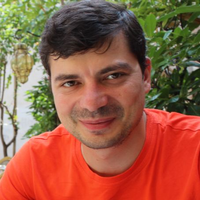

# Roman Kozhara



***

## Contacts

          | *edinorog15*                             |        | _roman.kozhara@gmail.com_
-----------------------------------------|:-------------------------------------|---------------------------------------|:--------------------------
      | @leshiy77                                  |           | +380507604577
 | [send me](https://t.me/benyarif) |  | @leshiy77

***
## About me

I'm 44 years old. For 20 years I have worked in sales at all levels. I have experience in implementing large projects, as well as managing industrial enterprises. Because of the crisis, I decided to fulfill my youthful desires and become a programmer. I know the basics of Python.  Now I study at the RS school on the JS frontend.

***

## Skills

| |  |  |  |
|:----------------------------------:|:---------------------------------:|:------------------------------:|:------------------------------------------:|
|basic knowledge                       |junior knowledge                     | junior knowledge                | junior knowledge                               |


***

## Code Example 


```Javascript
         function nthFibo(n) {
             let fibonachiArray = [0, 1];
             for (let i = 0; i < n; i++) {
                fibonachiArray.push(fibonachiArray[i] + fibonachiArray[i+1]);
            }
            return fibonachiArray[n-1]  
        }
```

***

## Project 

[Movie App](https://rolling-scopes-school.github.io/leshiy77-JSFEPRESCHOOL/js30movie-app/)  
[Portfolio Photo](https://rolling-scopes-school.github.io/leshiy77-JSFEPRESCHOOL/portfolio/)  
[Audio player](https://rolling-scopes-school.github.io/leshiy77-JSFEPRESCHOOL/js30audio-player/)  
[Image Gallery](https://rolling-scopes-school.github.io/leshiy77-JSFEPRESCHOOL/js30image-gallery/)  
[Random Game](https://rolling-scopes-school.github.io/leshiy77-JSFEPRESCHOOL/js30random-game/)  
[Random Jokes](https://rolling-scopes-school.github.io/leshiy77-JSFEPRESCHOOL/js30random-jokes/)  
[Eco-sound](https://rolling-scopes-school.github.io/leshiy77-JSFEPRESCHOOL/js30eco-sound/)  
## Education


2000 - Donetsk University of Economics and Trade
Management specialist

## Language

Russian - native
English - B1
Ukraine - C1